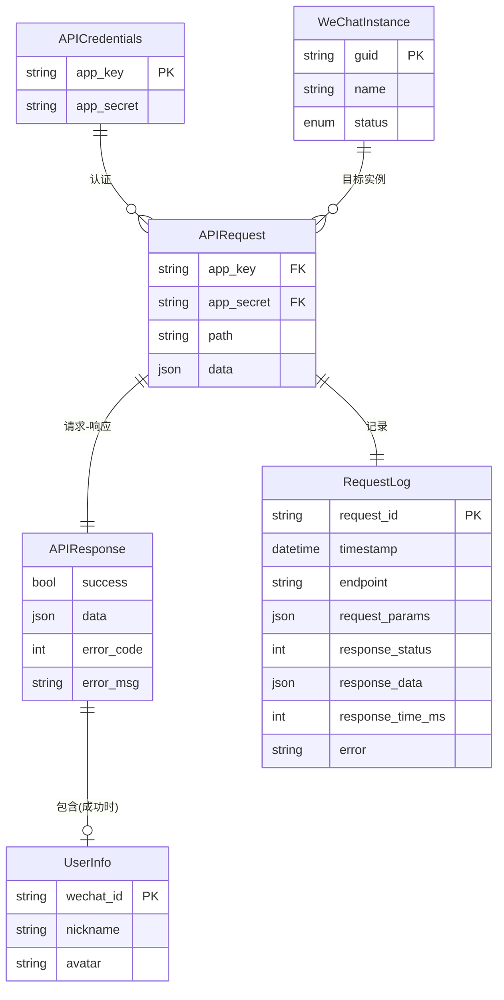

# Data Model: 微信 API 连通性测试

**Feature**: 001-wechat-api-connectivity
**Date**: 2025-11-01
**Purpose**: 定义微信 API 连接测试功能涉及的核心实体、数据结构和关系

## 1. 核心实体

### 1.1 API 凭证 (APICredentials)

**描述**: 用于认证微信 API 请求的身份标识

**字段**:

| 字段名 | 类型 | 必填 | 验证规则 | 描述 |
|--------|------|------|----------|------|
| `app_key` | `str` | ✅ | `len >= 10` | API 密钥,标识应用身份 |
| `app_secret` | `str` | ✅ | `len >= 20` | API 密钥,用于签名认证 |

**Pydantic 模型**:

```python
from pydantic import BaseModel, Field

class APICredentials(BaseModel):
    """API 凭证模型"""
    app_key: str = Field(..., min_length=10, description="API Key")
    app_secret: str = Field(..., min_length=20, description="API Secret")

    class Config:
        frozen = True  # 不可变对象,防止意外修改
```

**存储**: 配置文件 (`config/wechat.yaml`)
**安全**: 必须脱敏后记录日志,不提交到版本控制

---

### 1.2 微信实例 (WeChatInstance)

**描述**: 由设备 ID (guid) 标识的微信客户端实例,是所有业务操作的目标对象

**字段**:

| 字段名 | 类型 | 必填 | 验证规则 | 描述 |
|--------|------|------|----------|------|
| `guid` | `str` | ✅ | UUID 格式 | 设备唯一标识符 |
| `name` | `str` | ❌ | `len <= 50` | 设备别名(便于管理) |
| `status` | `Literal["online", "offline", "unknown"]` | ✅ | 枚举值 | 实例状态 |

**Pydantic 模型**:

```python
from pydantic import BaseModel, Field, field_validator
from typing import Literal
import uuid

class WeChatInstance(BaseModel):
    """微信实例模型"""
    guid: str = Field(..., description="设备唯一标识符")
    name: str = Field(default="", max_length=50, description="设备别名")
    status: Literal["online", "offline", "unknown"] = Field(
        default="unknown",
        description="实例状态"
    )

    @field_validator("guid")
    @classmethod
    def validate_guid(cls, v: str) -> str:
        """验证 GUID 格式"""
        try:
            uuid.UUID(v)
        except ValueError:
            raise ValueError(f"无效的 GUID 格式: {v}")
        return v
```

**状态转换**:
```
unknown → online (成功获取账号信息)
unknown → offline (设备不存在/离线)
online → offline (连接失败)
```

---

### 1.3 API 请求 (APIRequest)

**描述**: 微信 API 的完整请求结构

**字段**:

| 字段名 | 类型 | 必填 | 验证规则 | 描述 |
|--------|------|------|----------|------|
| `app_key` | `str` | ✅ | `len >= 10` | API 密钥 |
| `app_secret` | `str` | ✅ | `len >= 20` | API 密钥 |
| `path` | `str` | ✅ | 正则: `^/[\w/]+$` | API 路径(如 `/user/get_info`) |
| `data` | `Dict[str, Any]` | ✅ | 必须包含 `guid` | 业务参数 |

**Pydantic 模型**:

```python
from pydantic import BaseModel, Field, field_validator
from typing import Dict, Any

class APIRequest(BaseModel):
    """微信 API 请求模型"""
    app_key: str = Field(..., min_length=10, description="API Key")
    app_secret: str = Field(..., min_length=20, description="API Secret")
    path: str = Field(..., pattern=r"^/[\w/]+$", description="API 路径")
    data: Dict[str, Any] = Field(default_factory=dict, description="业务参数")

    @field_validator("data")
    @classmethod
    def validate_guid(cls, v: Dict[str, Any]) -> Dict[str, Any]:
        """验证业务参数必须包含 guid"""
        if "guid" not in v:
            raise ValueError("data 必须包含 guid 字段")
        return v

    def to_json(self) -> Dict[str, Any]:
        """转换为 JSON 请求体"""
        return self.model_dump()
```

**JSON 格式示例**:

```json
{
  "app_key": "YOUR_APP_KEY_HERE",
  "app_secret": "YOUR_APP_SECRET_HERE",
  "path": "/user/get_info",
  "data": {
    "guid": "XXXXXXXX-XXXX-XXXX-XXXX-XXXXXXXXXXXX"
  }
}
```

---

### 1.4 API 响应 (APIResponse)

**描述**: 微信 API 的通用响应结构

**字段**:

| 字段名 | 类型 | 必填 | 描述 |
|--------|------|------|------|
| `success` | `bool` | ✅ | 请求是否成功 |
| `data` | `Dict[str, Any]` | ❌ | 成功时返回的业务数据 |
| `error_code` | `int` | ❌ | 错误代码(失败时) |
| `error_msg` | `str` | ❌ | 错误信息(失败时) |

**Pydantic 模型**:

```python
from pydantic import BaseModel, Field
from typing import Dict, Any, Optional

class APIResponse(BaseModel):
    """微信 API 响应模型"""
    success: bool = Field(..., description="请求是否成功")
    data: Optional[Dict[str, Any]] = Field(default=None, description="业务数据")
    error_code: int = Field(default=0, description="错误代码")
    error_msg: str = Field(default="", description="错误信息")

    def is_success(self) -> bool:
        """判断请求是否成功"""
        return self.success and self.error_code == 0
```

**JSON 格式示例** - 成功:

```json
{
  "success": true,
  "data": {
    "wechat_id": "test_user_123",
    "nickname": "测试用户",
    "avatar": "https://example.com/avatar.jpg"
  },
  "error_code": 0,
  "error_msg": ""
}
```

**JSON 格式示例** - 失败:

```json
{
  "success": false,
  "data": null,
  "error_code": 401,
  "error_msg": "认证失败:无效的 app_secret"
}
```

---

### 1.5 账号信息 (UserInfo)

**描述**: 从微信 API 获取的登录账号数据

**字段**:

| 字段名 | 类型 | 必填 | 描述 |
|--------|------|------|------|
| `wechat_id` | `str` | ✅ | 微信号 |
| `nickname` | `str` | ✅ | 昵称 |
| `avatar` | `str` | ❌ | 头像 URL |

**Pydantic 模型**:

```python
from pydantic import BaseModel, Field, HttpUrl
from typing import Optional

class UserInfo(BaseModel):
    """微信账号信息模型"""
    wechat_id: str = Field(..., description="微信号")
    nickname: str = Field(..., description="昵称")
    avatar: Optional[HttpUrl] = Field(default=None, description="头像 URL")
```

---

### 1.6 请求记录 (RequestLog)

**描述**: 记录 API 调用的详细信息,用于调试和审计

**字段**:

| 字段名 | 类型 | 必填 | 描述 |
|--------|------|------|------|
| `request_id` | `str` | ✅ | 请求唯一标识(UUID) |
| `timestamp` | `datetime` | ✅ | 请求时间(ISO 8601) |
| `endpoint` | `str` | ✅ | API 路径 |
| `request_params` | `Dict[str, Any]` | ✅ | 脱敏后的请求参数 |
| `response_status` | `int` | ✅ | HTTP 状态码 |
| `response_data` | `Dict[str, Any]` | ❌ | 脱敏后的响应数据 |
| `response_time_ms` | `int` | ✅ | 响应时间(毫秒) |
| `error` | `str` | ❌ | 错误信息(如有) |

**Pydantic 模型**:

```python
from pydantic import BaseModel, Field
from typing import Dict, Any, Optional
from datetime import datetime
import uuid

class RequestLog(BaseModel):
    """API 请求日志模型"""
    request_id: str = Field(default_factory=lambda: str(uuid.uuid4()), description="请求 ID")
    timestamp: datetime = Field(default_factory=datetime.utcnow, description="请求时间")
    endpoint: str = Field(..., description="API 路径")
    request_params: Dict[str, Any] = Field(..., description="脱敏后的请求参数")
    response_status: int = Field(..., description="HTTP 状态码")
    response_data: Optional[Dict[str, Any]] = Field(default=None, description="响应数据")
    response_time_ms: int = Field(..., ge=0, description="响应时间(毫秒)")
    error: Optional[str] = Field(default=None, description="错误信息")

    def to_json(self) -> Dict[str, Any]:
        """转换为 JSON 日志格式"""
        return self.model_dump(mode='json')
```

**JSON 日志示例**:

```json
{
  "request_id": "550e8400-e29b-41d4-a716-446655440000",
  "timestamp": "2025-11-01T14:32:15.123456Z",
  "endpoint": "/user/get_info",
  "request_params": {
    "app_key": "appk***",
    "app_secret": "Zvh1***",
    "path": "/user/get_info",
    "guid": "XXXXXXXX-XXXX-XXXX-XXXX-XXXXXXXXXXXX"
  },
  "response_status": 200,
  "response_data": {
    "success": true,
    "wechat_id_hash": "a3f2d4b1",
    "nickname_hash": "b9e1c7a2"
  },
  "response_time_ms": 245,
  "error": null
}
```

---

## 2. 实体关系



## 3. 数据流

### 3.1 成功场景

```
1. 加载 APICredentials (config/wechat.yaml)
   ↓
2. 构建 APIRequest (app_key + app_secret + path + data{guid})
   ↓
3. 发送 HTTP POST → https://chat-api.juhebot.com/open/GuidRequest
   ↓
4. 接收 APIResponse (success=true, data={...})
   ↓
5. 解析 UserInfo (wechat_id, nickname, avatar)
   ↓
6. 记录 RequestLog (脱敏后的请求/响应数据)
   ↓
7. 返回 UserInfo 给调用者
```

### 3.2 失败场景

```
1. 加载 APICredentials
   ↓
2. 构建 APIRequest
   ↓
3. 发送 HTTP POST
   ↓
4. 接收 APIResponse (success=false, error_code=401)
   或 HTTP 异常 (httpx.HTTPStatusError, httpx.TimeoutException)
   ↓
5. 分类错误 (AuthenticationError / NetworkError / TimeoutError)
   ↓
6. 记录 RequestLog (包含错误信息)
   ↓
7. 抛出自定义异常 (WeChatAPIError 子类)
```

## 4. 验证规则

### 4.1 必填字段验证

| 实体 | 必填字段 | 验证失败行为 |
|------|---------|-------------|
| `APICredentials` | `app_key`, `app_secret` | 抛出 `ValidationError` |
| `WeChatInstance` | `guid` | 抛出 `ValidationError` |
| `APIRequest` | `app_key`, `app_secret`, `path`, `data` | 抛出 `ValidationError` |
| `APIResponse` | `success` | 抛出 `ValidationError` |

### 4.2 格式验证

| 字段 | 格式规则 | 示例 |
|------|---------|------|
| `guid` | UUID v4 格式 | `XXXXXXXX-XXXX-XXXX-XXXX-XXXXXXXXXXXX` |
| `path` | 正则: `^/[\w/]+$` | `/user/get_info` |
| `avatar` | HTTP/HTTPS URL | `https://example.com/avatar.jpg` |
| `timestamp` | ISO 8601 | `2025-11-01T14:32:15.123456Z` |

### 4.3 业务规则验证

| 规则 | 描述 | 验证逻辑 |
|------|------|---------|
| `data` 必须包含 `guid` | 所有业务请求都需要设备 ID | `@field_validator("data")` |
| `app_key` 长度 ≥ 10 | 防止配置错误 | `min_length=10` |
| `app_secret` 长度 ≥ 20 | 防止配置错误 | `min_length=20` |
| `response_time_ms` ≥ 0 | 响应时间不能为负 | `ge=0` |

## 5. 敏感数据脱敏映射

| 原始字段 | 脱敏方式 | 脱敏后字段 | 示例 |
|---------|---------|-----------|------|
| `app_secret` | 前 4 位 + `***` | `app_secret` | `Zvh1***` |
| `app_key` | 前 4 位 + `***` | `app_key` | `appk***` |
| `wechat_id` | SHA-256 哈希前 8 位 | `wechat_id_hash` | `a3f2d4b1` |
| `nickname` | SHA-256 哈希前 8 位 | `nickname_hash` | `b9e1c7a2` |
| `guid` | 不脱敏(设备 ID,非个人敏感) | `guid` | 完整显示 |

**实现示例**:

```python
import hashlib

def mask_secret(secret: str) -> str:
    """脱敏 API 密钥"""
    return f"{secret[:4]}***" if len(secret) > 4 else "***"

def hash_pii(data: str) -> str:
    """哈希个人身份信息"""
    return hashlib.sha256(data.encode()).hexdigest()[:8]
```

## 6. 存储策略

| 数据类型 | 存储位置 | 格式 | 保留期 |
|---------|---------|------|--------|
| `APICredentials` | `config/wechat.yaml` | YAML | 永久(用户管理) |
| `RequestLog` | `logs/wechat_api.log` | JSON (每行一条) | 30 天(轮转) |
| `WeChatInstance` | 配置文件 | YAML | 永久 |
| 测试数据 | `tests/fixtures/` | JSON | 永久(版本控制) |

## 7. 契约定义

所有 Pydantic 模型都可自动生成 JSON Schema,用于契约测试:

```python
# 生成 JSON Schema
from diting.endpoints.wechat.models import APIRequest, APIResponse

request_schema = APIRequest.model_json_schema()
response_schema = APIResponse.model_json_schema()

# 保存到 contracts/
with open("contracts/api_request.schema.json", "w") as f:
    json.dump(request_schema, f, indent=2)

with open("contracts/api_response.schema.json", "w") as f:
    json.dump(response_schema, f, indent=2)
```

**契约文件位置**:
- `specs/001-wechat-api-connectivity/contracts/api_request.schema.json`
- `specs/001-wechat-api-connectivity/contracts/api_response.schema.json`

---

**总结**: 本数据模型定义了 6 个核心实体,明确了字段验证规则、敏感数据脱敏策略和存储方案,为后续实现提供了清晰的数据结构指导。
