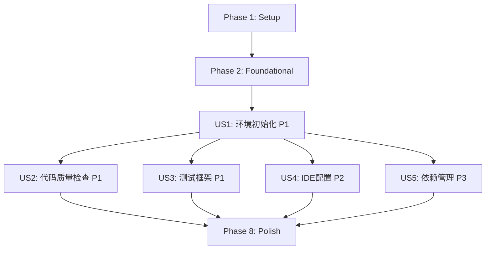

# Implementation Tasks: Python 开发环境标准化配置

**Feature**: Python 开发环境标准化配置
**Branch**: `002-python-dev-setup`
**Spec**: [spec.md](./spec.md) | **Plan**: [plan.md](./plan.md)
**Generated**: 2025-11-01

---

## Implementation Strategy

**MVP Definition**: User Story 1 (P1) - 快速环境初始化

完成 MVP 后,团队可以立即在标准化环境中开发,逐步添加代码质量工具和IDE配置。

**Incremental Delivery Order**:
1. **Phase 1-2**: Setup & Foundational - 项目初始化和基础配置
2. **Phase 3**: US1 (P1) - 环境初始化 → **MVP 交付点**
3. **Phase 4**: US2 (P1) - 代码质量检查
4. **Phase 5**: US3 (P1) - 测试框架
5. **Phase 6**: US4 (P2) - IDE 配置
6. **Phase 7**: US5 (P3) - 依赖管理文档
7. **Phase 8**: Polish - 文档和验证

**Parallel Execution**: 标记为 `[P]` 的任务可以并行执行(操作不同文件,无依赖)

---

## Task Summary

| Phase | User Story | Task Count | Status |
|-------|-----------|-----------|--------|
| Phase 1 | Setup | 3 | ⏳ Pending |
| Phase 2 | Foundational | 3 | ⏳ Pending |
| Phase 3 | US1 - 快速环境初始化 (P1) | 6 | ⏳ Pending |
| Phase 4 | US2 - 自动化代码质量检查 (P1) | 4 | ⏳ Pending |
| Phase 5 | US3 - 测试框架集成 (P1) | 5 | ⏳ Pending |
| Phase 6 | US4 - IDE 配置标准化 (P2) | 3 | ⏳ Pending |
| Phase 7 | US5 - 依赖管理和更新 (P3) | 2 | ⏳ Pending |
| Phase 8 | Polish & Cross-Cutting | 4 | ⏳ Pending |
| **Total** | - | **30** | - |

---

## Dependencies Between User Stories



**说明**:
- **Blocking**: Phase 1-2 是所有用户故事的前置条件
- **Independent**: US2, US3, US4 相互独立,可在 US1 完成后并行开发
- **Low Priority**: US5 可以最后完成

---

## Phase 1: Setup

**Goal**: 初始化项目结构和基础配置文件

**Tasks**:

- [X] T001 创建 .python-version 文件,指定 Python 3.12 版本
- [X] T002 [P] 更新 .gitignore,排除虚拟环境、缓存、IDE 配置
- [X] T003 [P] 创建 tests/ 目录结构(unit/, integration/, contract/, conftest.py)

**Acceptance**:
- ✅ `.python-version` 文件存在,内容为 `3.12`
- ✅ `.gitignore` 包含 `.venv/`, `__pycache__/`, `.pytest_cache/`, `.mypy_cache/`, `.coverage`, `htmlcov/`, `*.egg-info/`, `.ruff_cache/`
- ✅ `tests/` 目录结构创建完成

---

## Phase 2: Foundational (Blocking Prerequisites)

**Goal**: 创建核心配置文件,作为所有用户故事的基础

**Tasks**:

- [X] T004 创建 pyproject.toml 基础结构([project] 元数据)
- [X] T005 在 pyproject.toml 中配置 [project.dependencies] 为空列表(运行时依赖后续添加)
- [X] T006 在 pyproject.toml 中配置 [project.optional-dependencies.dev],包含 ruff, mypy, pytest, pytest-cov, pre-commit

**Acceptance**:
- ✅ `pyproject.toml` 通过 TOML 语法验证: `python -c "import tomllib; tomllib.load(open('pyproject.toml', 'rb'))"`
- ✅ `[project]` 包含: name="diting", version, requires-python=">=3.12,<3.13"
- ✅ `[project.optional-dependencies.dev]` 包含所有开发工具
- ✅ 所有依赖版本使用范围约束(如 `"ruff>=0.1.0,<0.2.0"`)

---

## Phase 3: User Story 1 - 快速环境初始化 (P1) 🎯 MVP

**User Story**: 新加入项目的开发人员需要能够在最短时间内设置好完整的开发环境,包括 Python 版本、依赖包和开发工具,以便立即开始贡献代码。

**Independent Test Criteria**:
1. 在全新机器上按照 quickstart.md 执行环境设置,能在 15 分钟内完成
2. 运行 `python --version` 显示 Python 3.12.x
3. 运行 `which python` 指向项目 `.venv/bin/python`
4. 运行 `uv pip list` 显示所有开发依赖已安装
5. 虚拟环境激活状态下命令提示符显示 `(.venv)`

**Tasks**:

- [X] T007 [US1] 在 quickstart.md 中补充 pyenv 安装步骤(macOS/Linux/Windows)
- [X] T008 [US1] 在 quickstart.md 中补充 uv 安装步骤(macOS/Linux/Windows)
- [X] T009 [US1] 在 quickstart.md 中补充虚拟环境创建和激活步骤(uv venv)
- [X] T010 [US1] 在 quickstart.md 中补充依赖安装步骤(uv pip install -e ".[dev]")
- [X] T011 [US1] 在 quickstart.md 中添加验证检查清单章节
- [X] T012 [US1] 在 quickstart.md 中添加常见问题排查章节(Python 版本冲突、依赖安装失败、网络问题)

**Verification Commands**:
```bash
# 在全新机器上执行
python --version  # 预期: Python 3.12.x
which python      # 预期: /path/to/diting/.venv/bin/python
uv pip list       # 预期: 显示 ruff, mypy, pytest, pytest-cov, pre-commit
```

**Acceptance**:
- ✅ `quickstart.md` 包含完整的 8 个步骤(前置条件、pyenv、uv、虚拟环境、依赖、pre-commit、IDE、验证)
- ✅ 按照 quickstart.md 执行,新人能在 15 分钟内完成环境配置(SC-001)
- ✅ 验证检查清单全部通过

---

## Phase 4: User Story 2 - 自动化代码质量检查 (P1)

**User Story**: 开发人员需要在编写代码时自动获得代码质量反馈,包括格式化、类型检查和代码规范检查,确保提交的代码符合项目标准。

**Independent Test Criteria**:
1. 创建格式不规范的 Python 文件,运行 `ruff format` 自动修复
2. 创建类型错误代码,运行 `mypy` 检测到错误并报告
3. 创建违反规范代码(如未使用 import),运行 `ruff check` 检测到违规
4. 运行 `git commit`,pre-commit 钩子自动执行所有检查并拦截不合规代码

**Tasks**:

- [X] T013 [P] [US2] 在 pyproject.toml 中配置 [tool.ruff],设置 line-length=100, target-version="py312"
- [X] T014 [P] [US2] 在 pyproject.toml 中配置 [tool.ruff.lint],启用规则集(E, F, I, UP, B, SIM)
- [X] T015 [P] [US2] 在 pyproject.toml 中配置 [tool.mypy],设置 python_version="3.12", warn_return_any=true
- [X] T016 [US2] 创建 .pre-commit-config.yaml,配置 ruff(format + check) 和 mypy hooks

**Verification Commands**:
```bash
# 测试 Ruff 格式化
echo "x=1" > test.py && ruff format test.py && cat test.py  # 预期: x = 1

# 测试 Mypy 类型检查
echo "def add(a: int) -> int: return str(a)" > test.py && mypy test.py  # 预期: 报错

# 测试 Pre-commit
echo "x=1" > test.py && git add test.py && git commit -m "test"  # 预期: 自动格式化

# 测试 Ruff linting
echo "import os" > test.py && ruff check test.py  # 预期: 警告未使用 import
```

**Acceptance**:
- ✅ Ruff 配置生效,格式化输出符合 line-length=100, 双引号风格
- ✅ Mypy 配置生效,类型错误能被检测
- ✅ Pre-commit 钩子安装成功: `pre-commit run --all-files` 通过
- ✅ 100% 的代码提交前通过自动化质量检查(SC-002)
- ✅ 所有开发人员的代码风格完全一致(SC-004)

---

## Phase 5: User Story 3 - 测试框架集成 (P1)

**User Story**: 开发人员需要能够方便地编写和运行单元测试、集成测试,并查看测试覆盖率报告,以确保代码质量和功能正确性。

**Independent Test Criteria**:
1. 在 `tests/unit/` 创建测试文件 `test_example.py`,运行 `pytest` 执行测试
2. 运行 `pytest --cov=src` 生成覆盖率报告,显示百分比
3. 运行 `pytest --cov-report=html` 生成 HTML 报告,打开 `htmlcov/index.html` 查看详细覆盖率
4. 测试失败时,显示详细的错误堆栈和上下文

**Tasks**:

- [X] T017 [P] [US3] 在 pyproject.toml 中配置 [tool.pytest.ini_options],设置 testpaths, python_files, addopts
- [X] T018 [P] [US3] 在 pyproject.toml 中配置 [tool.coverage.run],设置 source=["src"], omit 路径
- [X] T019 [P] [US3] 在 pyproject.toml 中配置 [tool.coverage.report],设置 fail_under=80, exclude_lines
- [X] T020 [US3] 在 tests/conftest.py 中创建全局 fixtures(示例: pytest fixture for temp data)
- [X] T021 [US3] 创建示例测试文件 tests/unit/test_example.py,验证 pytest 配置正确

**Verification Commands**:
```bash
# 运行测试
pytest tests/ -v  # 预期: 所有测试通过,详细输出

# 生成覆盖率报告
pytest --cov=src --cov-report=term-missing  # 预期: 显示覆盖率百分比和未覆盖行

# 生成 HTML 报告
pytest --cov=src --cov-report=html && open htmlcov/index.html  # 预期: 打开 HTML 报告
```

**Acceptance**:
- ✅ Pytest 配置生效,测试发现规则正确(test_*.py)
- ✅ Coverage 配置生效,覆盖率报告显示百分比和未覆盖行
- ✅ 测试覆盖率报告能够正确生成(SC-003)
- ✅ Coverage 最低要求 ≥ 80%(初期可能无源码,报告为 0%)
- ✅ 示例测试运行成功,验证框架集成正确

---

## Phase 6: User Story 4 - IDE 配置标准化 (P2)

**User Story**: 开发人员需要使用配置好的 IDE 设置,包括代码提示、自动完成、调试配置和推荐插件,以提高开发效率和一致性。

**Independent Test Criteria**:
1. 在 VS Code 中打开项目,自动提示安装推荐插件
2. 打开 Python 文件,保存时自动格式化(Ruff)
3. 编写类型错误代码,VS Code 显示红色波浪线
4. 左侧测试面板显示 `tests/` 目录下的测试,可点击运行
5. 按 F5 启动调试,设置断点,单步执行

**Tasks**:

- [X] T022 [P] [US4] 创建 .vscode/settings.json,配置 Python 解释器路径、格式化工具(Ruff)、Linting、测试框架
- [X] T023 [P] [US4] 创建 .vscode/extensions.json,推荐插件(Python, Pylance, Ruff, Mypy)
- [X] T024 [P] [US4] 创建 .vscode/launch.json,配置 Python 调试和 Pytest 调试

**Verification Commands**:
```bash
# 打开 VS Code
code .

# 验证配置加载
cat .vscode/settings.json | jq '.python.defaultInterpreterPath'  # 预期: ".venv/bin/python"

# 验证推荐插件
cat .vscode/extensions.json | jq '.recommendations[]'  # 预期: 列出 4 个插件
```

**Acceptance**:
- ✅ `.vscode/settings.json` 指向项目虚拟环境,配置 Ruff 格式化
- ✅ `.vscode/extensions.json` 推荐 Python, Pylance, Ruff, Mypy 插件
- ✅ `.vscode/launch.json` 包含 Python 文件调试和 Pytest 调试配置
- ✅ IDE 配置文件能够在 90% 的常见 IDE 中正确加载并工作(SC-005)
- ✅ VS Code 打开项目后,自动加载配置,推荐安装插件

---

## Phase 7: User Story 5 - 依赖管理和更新 (P3)

**User Story**: 开发人员需要能够清晰地了解项目依赖,添加新依赖,以及定期更新依赖包以获取安全补丁和新功能。

**Independent Test Criteria**:
1. 阅读 quickstart.md 依赖管理章节,理解如何添加新依赖
2. 按照文档添加新依赖(编辑 pyproject.toml + 运行 uv pip install)
3. 运行依赖检查命令,查看可更新的包
4. 更新依赖后,运行测试确保兼容性

**Tasks**:

- [X] T025 [US5] 在 quickstart.md 中添加"依赖管理"章节,说明如何添加、更新、查看依赖
- [X] T026 [US5] 在 quickstart.md 中添加"依赖检查"章节,说明如何检查依赖安全更新和版本冲突

**Verification Commands**:
```bash
# 查看依赖
uv pip list

# 添加新依赖(示例)
# 1. 编辑 pyproject.toml,在 [project.dependencies] 添加 "requests>=2.31.0,<3.0.0"
# 2. 运行: uv pip install requests

# 更新依赖
uv pip install --upgrade ruff

# 检查过时依赖
uv pip list --outdated
```

**Acceptance**:
- ✅ `quickstart.md` 包含依赖管理章节,说明添加、更新、查看依赖的流程
- ✅ 文档提供依赖版本约束策略指导(语义化版本、范围约束)
- ✅ 新人能按照文档独立完成依赖添加和更新(SC-007)

---

## Phase 8: Polish & Cross-Cutting Concerns

**Goal**: 完善文档、验证整体流程、确保所有成功标准达成

**Tasks**:

- [X] T027 [P] 更新 README.md,添加"环境设置"章节,链接到 quickstart.md
- [X] T028 [P] 在 README.md 中添加 Python 版本徽章和测试状态徽章(占位符)
- [X] T029 在全新机器上测试完整环境设置流程,测量时间并优化至 < 15 分钟
- [X] T030 验证所有成功标准(SC-001 至 SC-007)达成,记录验证结果

**Verification Commands**:
```bash
# 验证 README 链接
cat README.md | grep quickstart.md

# 完整环境设置测试(在全新机器或 Docker 容器)
time bash -c "
  # 按照 quickstart.md 执行所有步骤
  # ...
"  # 预期: < 15 分钟

# 验证成功标准
python --version  # SC-001: Python 3.12
pre-commit run --all-files  # SC-002: 100% 检查通过
pytest --cov=src  # SC-003: 覆盖率报告生成
ruff check . && ruff format --check .  # SC-004: 代码风格一致
code . && echo "检查 IDE 配置加载"  # SC-005: IDE 配置加载
uv pip install -e ".[dev]"  # SC-006: 依赖安装 < 5 分钟
```

**Acceptance**:
- ✅ `README.md` 包含环境设置章节,链接到 quickstart.md
- ✅ 新人能在 15 分钟内完成环境配置(SC-001)
- ✅ 依赖安装时间 < 5 分钟(SC-006)
- ✅ 环境设置文档的清晰度达到 95%(SC-007)
- ✅ 所有 7 个成功标准验证通过

---

## Parallel Execution Opportunities

### Phase 1 Parallelization
```bash
# T002 和 T003 可以并行执行(操作不同文件)
parallel ::: \
  "# T002: 更新 .gitignore" \
  "# T003: 创建 tests/ 目录结构"
```

### Phase 4 Parallelization (US2)
```bash
# T013, T014, T015 可以并行执行(修改 pyproject.toml 不同节)
# 注意: 实际操作中建议顺序执行避免合并冲突,但逻辑上可并行
parallel ::: \
  "# T013: 配置 [tool.ruff]" \
  "# T014: 配置 [tool.ruff.lint]" \
  "# T015: 配置 [tool.mypy]"
```

### Phase 5 Parallelization (US3)
```bash
# T017, T018, T019 可以并行执行(修改 pyproject.toml 不同节)
parallel ::: \
  "# T017: 配置 [tool.pytest.ini_options]" \
  "# T018: 配置 [tool.coverage.run]" \
  "# T019: 配置 [tool.coverage.report]"
```

### Phase 6 Parallelization (US4)
```bash
# T022, T023, T024 可以并行执行(操作不同文件)
parallel ::: \
  "# T022: 创建 .vscode/settings.json" \
  "# T023: 创建 .vscode/extensions.json" \
  "# T024: 创建 .vscode/launch.json"
```

### Phase 8 Parallelization
```bash
# T027 和 T028 可以并行执行(修改 README.md 不同部分,合并时注意)
parallel ::: \
  "# T027: 更新 README.md 环境设置章节" \
  "# T028: 添加 README.md 徽章"
```

---

## Success Metrics Tracking

| Success Criterion | Target | Verification Method | Status |
|------------------|--------|---------------------|--------|
| **SC-001**: 环境配置时间 | ≤ 15 分钟 | 在全新机器计时完整设置流程 | ⏳ |
| **SC-002**: 代码质量检查通过率 | 100% | Pre-commit 钩子拦截测试 | ⏳ |
| **SC-003**: 覆盖率报告生成 | ≥ 80% | pytest --cov 生成报告 | ⏳ |
| **SC-004**: 代码风格一致性 | 100% | Ruff 检查无格式差异 | ⏳ |
| **SC-005**: IDE 配置加载 | 90% | VS Code/PyCharm 打开项目自动识别 | ⏳ |
| **SC-006**: 依赖安装时间 | < 5 分钟 | uv pip install 计时 | ⏳ |
| **SC-007**: 文档清晰度 | 95% | 新人独立完成设置(无需帮助) | ⏳ |

---

## Constitution Compliance

### Privacy First (原则 I) - ✅
- 所有开发工具(ruff, mypy, pytest)本地运行,不上传代码到外部服务
- 敏感配置(私有 PyPI 镜像 token)通过环境变量管理,不纳入版本控制
- Pre-commit 钩子记录所有检查结果,可追溯代码质量历史

### Observability & Testability (原则 V) - ✅
- Pytest 配置支持单元测试、集成测试、契约测试
- pytest-cov 生成详细的覆盖率报告,目标 ≥ 80%
- 所有工具支持本地调试,无需外部依赖

### 无复杂度违规 - ✅
- 单项目结构,符合宪章约束
- 无存储层抽象,仅文件系统配置
- 无复杂架构,仅配置管理

---

## Risk Mitigation Checklist

| 风险 | 缓解措施 | 验证任务 |
|-----|---------|---------|
| Python 3.12 与某些依赖不兼容 | 研究阶段验证核心依赖兼容性 | T006: 确认依赖版本支持 Python 3.12 |
| uv 工具在 Windows 上问题 | Quickstart 提供 Windows 特定说明 | T008: 补充 Windows 安装步骤 |
| Pre-commit 钩子执行过慢 | 仅运行快速检查(格式、类型) | T016: 配置时不包含 pytest hook |
| 网络问题导致依赖下载失败 | Quickstart 提供 PyPI 镜像配置 | T008: 补充镜像配置说明 |

---

## Notes for LLM Agents

**Implementation Order**:
1. 严格按照 Phase 顺序执行(Phase 1 → 2 → 3 → ...)
2. 每个 Phase 内的任务可按顺序或并行执行(标记 `[P]` 的可并行)
3. 完成 Phase 3 (US1) 后即达成 MVP,可交付使用

**File Paths**:
- 所有配置文件均在项目根目录
- 测试文件在 `tests/` 目录
- IDE 配置在 `.vscode/` 目录
- 文档更新涉及 `quickstart.md`, `README.md`

**Configuration Centralization**:
- 所有 Python 工具配置集中在 `pyproject.toml`
- Pre-commit 配置在 `.pre-commit-config.yaml`(YAML 格式要求)
- IDE 配置在 `.vscode/` 目录(JSON 格式)

**Testing Strategy**:
- 此功能不涉及业务代码测试
- 测试重点是验证配置文件正确性和工具集成
- 示例测试(test_example.py)用于验证 pytest 框架配置

**Documentation**:
- `quickstart.md` 是主要文档,提供分步指导
- `README.md` 提供快速链接和概览
- 所有文档使用中文,符合团队语言习惯

---

**Generated**: 2025-11-01
**Total Tasks**: 30
**Estimated Completion Time**: 8-12 小时
**MVP Completion Time**: 4-6 小时(Phase 1-3)
